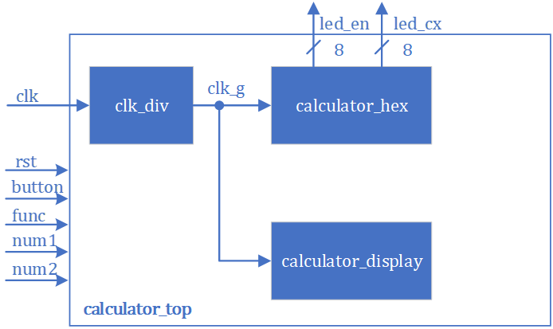

# S2

设计一个十六进制的计算器，支持加、减、乘、求商，求余，平方六种运算，且支持连续运算功能；

**详细要求如下：**

A． 输入时钟为100MHz，端口为Y18；

B． 使用按键开关S1作为异步复位信号，且当S1为1时，数码管模块将被复位；

C． 按键开关S2作为每次计算启动信号（类似等于号功能）；

D． 操作数由拨码开关SW15-SW0输入，操作数1为SW15-SW8，操作数2为SW7-SW0；

E． 连续运算时，输入的数据为操作数2；（平方运算时，为上一次计算结果）

当前运算功能由拨码开关SW23-SW21来决定：

F． 当前运算功能由拨码开关SW23-SW21来决定：

G． 计算结果实时输出到数码管上；

# S3

#### 1 自顶向下的结构化设计方法

自顶向下的设计方法是指在设计过程中，设计开发人员首先从整体上规划整个系统的功能和性能，然后根据具体需求和系统功能对系统进行子模块划分，从而将整个系统分解为规模较小、功能较简单的子模块，并在这个过程中确立子模块之间的交互关系和接口。这个过程可以不断地进行下去，直到最终得到的子模块可以很容易地映射到物理层面实现。

由于整个设计是从系统顶层开始的，设计过程中可以很容易地根据实际需求，对整体方案进行调整。随着设计逐渐向下细化，系统的组成和功能将得到进一步的细化，并随时可根据需要加以修正和调整，从而保证设计的正确性，缩短设计周期。与其他设计方法相比，设计规模越大，自顶向下的优势越明显。

我们也可以利用自顶向下的结构化设计方法应用到数字系统的设计上。首先将一个比较复杂的数字电路划分为多个组成模块，再分别对每个模块建模，然后将这些模块组成一个总模块，完成所需的功能。结构化设计的基本单位是模块，每个模块的组成可以遵循以下规则：

（1）在设计中至少被使用两次的逻辑，该逻辑采用实例化方式重用，为增加代码的易读性和整洁性，可将其封装成模块，如译码器、多路选择器等；

（2）功能规格十分明确，且与外界的交互信号数目不是很多的，封装成模块，如消抖模块等；

（3）现有的一个模块达到了数千行代码的规模，将其拆分成若干和小模块；

（4）一个文件中只包含一个模块，便于后期代码维护。

本实验包含寄存器、计数器、数码管显示等内容，设计相对复杂。请同学们务必按照自顶向下的设计方法，先细化设计方案、做好模块划分，最后再编码实现。

#### 2 模块划分

可以将整个系统分为3个模块：

**clk_div**：用于时钟分频；

**calculator_hex**：实现计算器计算功能；

**calculator_display**：实现计算器结果在数码管上显示；

#### 3 接口定义

